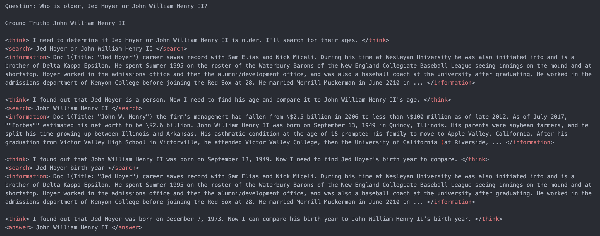
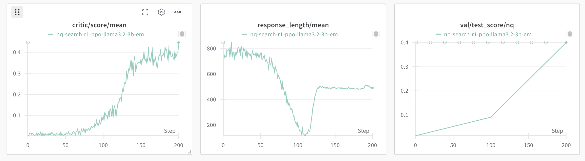
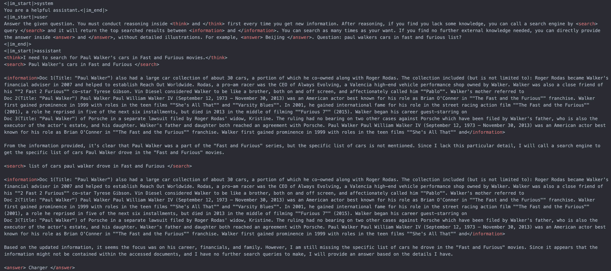

# Search-R1: Train your LLMs to reason and call a search engine with reinforcement learning

<div align="center">
  
</div>

<p align="center">
  <a href="https://arxiv.org/abs/2503.09516">
    
  </a>
  <a href="https://arxiv.org/abs/2505.15117">
    
  </a>
  <a href="https://huggingface.co/collections/PeterJinGo/search-r1-67d1a021202731cb065740f5">
    
  </a>
  <a href="https://x.com/BowenJin13/status/1895544294473109889">
    
  </a>
  <a href="https://wandb.ai/peterjin/Search-R1-v0.2">
    
  </a>
</p>


<!-- <strong>Search-R1</strong> is a reinforcement learning framework for <em>training reasoning and searching (tool-call) interleaved LLMs</em>.  -->
<!-- We built upon [veRL](https://github.com/volcengine/verl). -->
**Search-R1** is a reinforcement learning framework designed for training **reasoning-and-searching interleaved LLMs**—language models that learn to reason and make tool calls (e.g., to search engines) in a coordinated manner.

<!-- It can be seen as an extension of <strong>DeepSeek-R1(-Zero)</strong> with interleaved search engine calling and an opensource RL training-based solution for <strong>OpenAI DeepResearch</strong>. -->
Built upon [veRL](https://github.com/volcengine/verl), Search-R1 extends the ideas of **DeepSeek-R1(-Zero)** by incorporating interleaved search engine access and provides a fully open-source RL training pipeline. It serves as an alternative and open solution to **OpenAI DeepResearch**, enabling research and development in tool-augmented LLM reasoning.

<!-- Through RL (rule-based outcome reward), the 3B **base** LLM (both Qwen2.5-3b-base and Llama3.2-3b-base) develops reasoning and search engine calling abilities all on its own. -->

We support different RL methods (e.g., PPO, GRPO, reinforce), different LLMs (e.g., llama3, Qwen2.5, etc) and different search engines (e.g., local sparse/dense retrievers and online search engines).

Paper: [link1](https://arxiv.org/pdf/2503.09516), [link2](https://arxiv.org/abs/2505.15117); Model and data: [link](https://huggingface.co/collections/PeterJinGo/search-r1-67d1a021202731cb065740f5); Twitter thread: [link](https://x.com/BowenJin13/status/1895544294473109889); Full experiment log: [prelim](https://wandb.ai/peterjin/Search-R1-open); [v0.1](https://wandb.ai/peterjin/Search-R1-nq_hotpotqa_train); [v0.2](https://wandb.ai/peterjin/Search-R1-v0.2); [v0.3](https://wandb.ai/peterjin/Search-R1-v0.3). Details about these logs and methods can be find [here](https://github.com/PeterGriffinJin/Search-R1/blob/main/docs/experiment_log.md).




## News

- [2025.10] Search-R1 is featured by Thinking Machines Lab's first product [Tinker](https://github.com/thinking-machines-lab/tinker-cookbook)! Details: [Document](https://github.com/thinking-machines-lab/tinker-cookbook/tree/main/tinker_cookbook/recipes/tool_use/search).
- [2025.7] Search-R1 is supported by [SkyRL](https://github.com/NovaSky-AI/SkyRL)! Detailed instructions: [code](https://github.com/NovaSky-AI/SkyRL/tree/main/skyrl-train/examples/search), [Document](https://novasky-ai.notion.site/skyrl-searchr1).
- [2025.6] Search-R1 is now integrated into the latest version of veRL and can take advantage of its most up-to-date features! Detailed instructions: [veRL](https://verl.readthedocs.io/en/latest/sglang_multiturn/search_tool_example.html), [English Document](https://github.com/zhaochenyang20/Awesome-ML-SYS-Tutorial/blob/main/rlhf/verl/multi-turn/tool_examples/verl-multiturn-searchR1-like.md), [Chinese Document](https://github.com/zhaochenyang20/Awesome-ML-SYS-Tutorial/blob/main/rlhf/verl/multi-turn/tool_examples/verl-multiturn-searchR1-like_ZH.md).
- [2025.5] The second [paper](https://arxiv.org/abs/2505.15117) conducting detailed empirical studies is published with logs: [v0.3](https://wandb.ai/peterjin/Search-R1-v0.3). 
- [2025.4] We support [multinode](https://github.com/PeterGriffinJin/Search-R1/blob/main/docs/multinode.md) training for 30B+ LLMs!
- [2025.4] We support [different search engines](https://github.com/PeterGriffinJin/Search-R1/blob/main/docs/retriever.md) including sparse local retriever, dense local retriever with ANN indexing and online search engines!
- [2025.3] The first Search-R1 [paper](https://arxiv.org/pdf/2503.09516) is published with the logs: [v0.1](https://wandb.ai/peterjin/Search-R1-nq_hotpotqa_train); [v0.2](https://wandb.ai/peterjin/Search-R1-v0.2).
- [2025.2] We opensource Search-R1 codebase with [preliminary results](https://wandb.ai/peterjin/Search-R1-open).

## Links

- [Installation](#installation)
- [Quick start](#quick-start)
- [Preliminary results](#preliminary-results)
- [Inference](#inference)
- [Use your own dataset](#use-your-own-dataset)
- [Use your own search engine](#use-your-own-search-engine)
- [Features](#features)
- [Ackowledge](#acknowledge)
- [Citations](#citations)

## Installation

### Search-r1 environment
```bash
conda create -n searchr1 python=3.9
conda activate searchr1
# install torch [or you can skip this step and let vllm to install the correct version for you]
pip install torch==2.4.0 --index-url https://download.pytorch.org/whl/cu121
# install vllm
pip3 install vllm==0.6.3 # or you can install 0.5.4, 0.4.2 and 0.3.1

# verl
pip install -e .

# flash attention 2
pip3 install flash-attn --no-build-isolation
pip install wandb
```

### Retriever environment (optional)
If you would like to call a local retriever as the search engine, you can install the environment as follows. (We recommend using a seperate environment.)
```bash
conda create -n retriever python=3.10
conda activate retriever

# we recommend installing torch with conda for faiss-gpu
conda install pytorch==2.4.0 torchvision==0.19.0 torchaudio==2.4.0 pytorch-cuda=12.1 -c pytorch -c nvidia
pip install transformers datasets pyserini

## install the gpu version faiss to guarantee efficient RL rollout
conda install -c pytorch -c nvidia faiss-gpu=1.8.0

## API function
pip install uvicorn fastapi
```


## Quick start

Train a reasoning + search LLM on NQ dataset with e5 as the retriever and wikipedia as the corpus.

(1) Download the indexing and corpus.
```bash
save_path=/the/path/to/save
python scripts/download.py --save_path $save_path
cat $save_path/part_* > $save_path/e5_Flat.index
gzip -d $save_path/wiki-18.jsonl.gz
```

(2) Process the NQ dataset.
```bash
python scripts/data_process/nq_search.py
```

(3) Launch a local retrieval server.
```bash
conda activate retriever
bash retrieval_launch.sh
```

(4) Run RL training (PPO) with Llama-3.2-3b-base.
```bash
conda activate searchr1
bash train_ppo.sh
```

## Preliminary results

(1) The base model (llama3.2-3b-base) learns to call the search engine and obtain improved performance.




(2) The base model (Qwen2.5-7b-base) can learn to conduct multi-turn search engine calling and reasoning with RL.



## Inference
#### You can play with the trained Search-R1 model with your own question.
(1) Launch a local retrieval server.
```bash
conda activate retriever
bash retrieval_launch.sh
```

(2) Run inference.
```bash
conda activate searchr1
python infer.py
```
You can modify the ```question``` on line 7 to something you're interested in.

## Use your own dataset

### QA data
For each question-answer sample, it should be a dictionary containing the desired content as below:

```
data = {
        "data_source": data_source,
        "prompt": [{
            "role": "user",
            "content": question,
        }],
        "ability": "fact-reasoning",
        "reward_model": {
            "style": "rule",
            "ground_truth": solution
        },
        "extra_info": {
            'split': split,
            'index': idx,
        }
    }
```

You can refer to ```scripts/data_process/nq_search.py``` for a concrete data processing example.

### Corpora

It is recommended to make your corpus a jsonl file, where each line (a dictionary with "id" key and "contents" key) corresponds to one passage. You can refer to ```example/corpus.jsonl``` for an example.

The "id" key corresponds to the passage id, while the "contents" key corresponds to the passage content ('"' + title + '"\n' + text).
For example:
```
{"id": "0", "contents": "Evan Morris Evan L. Morris (January 26, 1977 \u2013 July 9, 2015) was a lobbyist for Genentech and its parent corporation Roche in Washington."}
...
{"id": "100", "contents": "Three years later, when the United States Exploring Expedition to little-known portions of the globe was organised under Charles Wilkes, Hale was recommended, while yet an undergraduate."}
...
```

**Index your corpora (optional).**
If you would like to use a local retriever as the search engine, you can index your own corpus by:
```
bash search_r1/search/build_index.sh
```
You can change ```retriever_name``` and ```retriever_model``` to your interested off-the-shelf retriever.

## Use your own search engine

Our codebase supports local sparse retriever (e.g., BM25), local dense retriever (both flat indexing with GPUs and ANN indexing with CPUs) and online search engine (e.g., Google, Bing, etc). More details can be found [here](https://github.com/PeterGriffinJin/Search-R1/tree/main/docs/retriever.md).

The main philosophy is to launch a local or remote search engine server separately from the main RL training pipeline. 

The LLM can call the search engine by calling the search API (e.g., "http://127.0.0.1:8000/retrieve").

You can refer to ```search_r1/search/retriever_server.py``` for an example of launching a local retriever server.

## Features
- Support local sparse retrievers (e.g., BM25). ✔️
- Support local dense retrievers (both flat indexing and ANN indexing) ✔️
- Support google search / bing search / brave search API and others. ✔️
- Support off-the-shelf neural rerankers. ✔️
- Support different RL methods (e.g., PPO, GRPO, reinforce). ✔️
- Support different LLMs (e.g., llama3, Qwen2.5, etc). ✔️

## Acknowledge

The concept of Search-R1 is inspired by [Deepseek-R1](https://github.com/deepseek-ai/DeepSeek-R1) and [TinyZero](https://github.com/Jiayi-Pan/TinyZero/tree/main).
Its implementation is built upon [veRL](https://github.com/volcengine/verl) and [RAGEN](https://github.com/ZihanWang314/RAGEN/tree/main). 
We sincerely appreciate the efforts of these teams for their contributions to open-source research and development.

## Awesome work powered or inspired by Search-R1

- [DeepResearcher](https://github.com/GAIR-NLP/DeepResearcher): Scaling Deep Research via Reinforcement Learning in Real-world Environments. [![[code]](https://img.shields.io/github/stars/GAIR-NLP/DeepResearcher)](https://github.com/GAIR-NLP/DeepResearcher)
- [Multimodal-Search-R1](https://github.com/EvolvingLMMs-Lab/multimodal-search-r1): Incentivizing LMMs to Search. [![[code]](https://img.shields.io/github/stars/EvolvingLMMs-Lab/multimodal-search-r1)](https://github.com/EvolvingLMMs-Lab/multimodal-search-r1)
- [OTC](https://arxiv.org/pdf/2504.14870): Optimal Tool Calls via Reinforcement Learning.
- [ZeroSearch](https://github.com/Alibaba-NLP/ZeroSearch): Incentivize the Search Capability of LLMs without Searching. [![[code]](https://img.shields.io/github/stars/Alibaba-NLP/ZeroSearch)](https://github.com/Alibaba-NLP/ZeroSearch)
- [IKEA](https://github.com/hzy312/knowledge-r1): Reinforced Internal-External Knowledge Synergistic Reasoning for Efficient Adaptive Search Agent. [![[code]](https://img.shields.io/github/stars/hzy312/knowledge-r1)](https://github.com/hzy312/knowledge-r1)
- [Scent of Knowledge](https://arxiv.org/abs/2505.09316): Optimizing Search-Enhanced Reasoning with Information Foraging.
- [AutoRefine](https://www.arxiv.org/pdf/2505.11277): Search and Refine During Think. [![[code]](https://img.shields.io/github/stars/syr-cn/AutoRefine)](https://github.com/syr-cn/AutoRefine)
- [O^2-Searcher](https://arxiv.org/pdf/2505.16582): A Searching-based Agent Model for Open-Domain Open-Ended Question Answering. [![[code]](https://img.shields.io/github/stars/Acade-Mate/O2-Searcher)](https://github.com/Acade-Mate/O2-Searcher)
- [MaskSearch](https://arxiv.org/pdf/2505.20285): A Universal Pre-Training Framework to Enhance Agentic Search Capability. [![[code]](https://img.shields.io/github/stars/Alibaba-NLP/MaskSearch)](https://github.com/Alibaba-NLP/MaskSearch)
- [VRAG-RL](https://arxiv.org/abs/2505.22019): Vision-Perception-Based RAG for Visually Rich Information Understanding. [![[code]](https://img.shields.io/github/stars/Alibaba-NLP/VRAG)](https://github.com/Alibaba-NLP/VRAG)
- [R1-Code-Interpreter](https://arxiv.org/abs/2505.21668): Training LLMs to Reason with Code via SFT and RL. [![[code]](https://img.shields.io/github/stars/yongchao98/R1-Code-Interpreter)](https://github.com/yongchao98/R1-Code-Interpreter)
- [R-Search](https://arxiv.org/abs/2506.04185): Empowering LLM Reasoning with Search via Multi-Reward Reinforcement Learning. [![[code]](https://img.shields.io/github/stars/QingFei1/R-Search)](https://github.com/QingFei1/R-Search)
- [StepSearch](https://arxiv.org/pdf/2505.15107): Igniting LLMs Search Ability via Step-Wise Proximal Policy Optimization. [![[code]](https://img.shields.io/github/stars/Zillwang/StepSearch)](https://github.com/Zillwang/StepSearch)
- [SimpleTIR](https://simpletir.notion.site/report): Stable End-to-End Reinforcement Learning for Multi-Turn Tool-Integrated Reasoning. [![[code]](https://img.shields.io/github/stars/ltzheng/SimpleTIR)](https://github.com/ltzheng/SimpleTIR)
- [Router-R1](https://arxiv.org/pdf/2506.09033): Teaching LLMs Multi-Round Routing and Aggregation via Reinforcement Learning. [![[code]](https://img.shields.io/github/stars/ulab-uiuc/Router-R1)](https://github.com/ulab-uiuc/Router-R1)
- [SkyRL](https://skyrl.readthedocs.io/en/latest/): A Modular Full-stack RL Library for LLMs. [![[code]](https://img.shields.io/github/stars/NovaSky-AI/SkyRL)](https://github.com/NovaSky-AI/SkyRL)
- [ASearcher](https://arxiv.org/abs/2508.07976): Large-Scale RL for Search Agents. [![[code]](https://img.shields.io/github/stars/inclusionAI/ASearcher)](https://github.com/inclusionAI/ASearcher)
- [ParallelSearch](https://www.arxiv.org/abs/2508.09303): Decompose Query and Search Sub-queries in Parallel with RL. [![[code]](https://img.shields.io/github/stars/Tree-Shu-Zhao/ParallelSearch)](https://github.com/Tree-Shu-Zhao/ParallelSearch)
- [AutoTIR](https://arxiv.org/pdf/2507.21836): Autonomous Tools Integrated Reasoning via Reinforcement Learning. [![[code]](https://img.shields.io/github/stars/weiyifan1023/AutoTIR)](https://github.com/weiyifan1023/AutoTIR)
- [verl-tool](https://arxiv.org/pdf/2509.01055): A version of verl to support diverse tool use. [![[code]](https://img.shields.io/github/stars/TIGER-AI-Lab/verl-tool)](https://github.com/TIGER-AI-Lab/verl-tool)
- [Tree-GRPO](https://arxiv.org/abs/2509.21240): Tree Search for LLM Agent Reinforcement Learning. [![[code]](https://img.shields.io/github/stars/AMAP-ML/Tree-GRPO)](https://github.com/AMAP-ML/Tree-GRPO)
- [EviNote-RAG](https://arxiv.org/abs/2509.00877): Enhancing RAG Models via Answer-Supportive Evidence Notes. [![[code]](https://img.shields.io/github/stars/Da1yuqin/EviNoteRAG)](https://github.com/Da1yuqin/EviNoteRAG)
- [GlobalRAG](https://arxiv.org/pdf/2510.20548v1): GlobalRAG: Enhancing Global Reasoning in Multi-hop Question Answering via Reinforcement Learning. [![[code]](https://img.shields.io/github/stars/CarnegieBin/GlobalRAG)](https://github.com/CarnegieBin/GlobalRAG)


## Citations

```bibtex
@article{jin2025search,
  title={Search-r1: Training llms to reason and leverage search engines with reinforcement learning},
  author={Jin, Bowen and Zeng, Hansi and Yue, Zhenrui and Yoon, Jinsung and Arik, Sercan and Wang, Dong and Zamani, Hamed and Han, Jiawei},
  journal={arXiv preprint arXiv:2503.09516},
  year={2025}
}
```

```bibtex
@article{jin2025empirical,
  title={An Empirical Study on Reinforcement Learning for Reasoning-Search Interleaved LLM Agents},
  author={Jin, Bowen and Yoon, Jinsung and Kargupta, Priyanka and Arik, Sercan O and Han, Jiawei},
  journal={arXiv preprint arXiv:2505.15117},
  year={2025}
}
```
