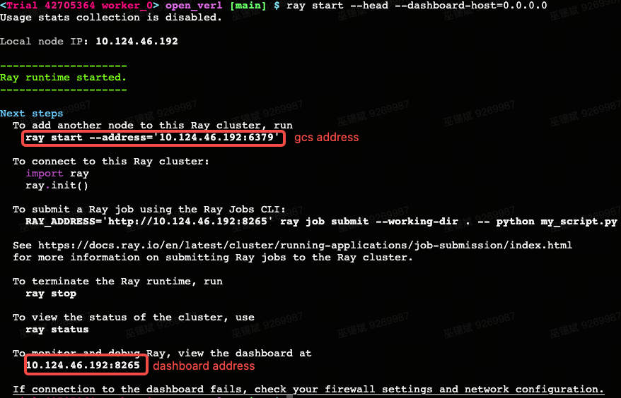
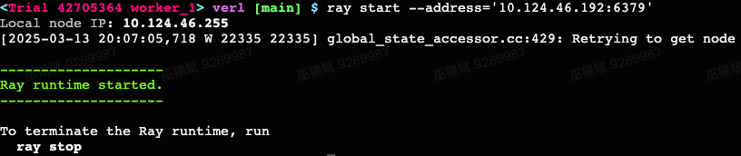
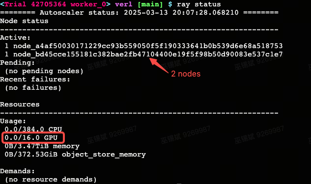

## Multinode Training

Our codebase supports multi-node training for large-scale language models. The implementation is mainly based on [Ray](https://github.com/ray-project/ray).

There are two types of nodes when doing Ray multi-node training: (1) head node and (2) worker nodes.
There is only one head node where you will start the ray cluster and submit the job.
The other nodes are worker nodes, where you only need to start and register to the ray cluster.

### Step 1: Set up multinode ray cluster (from [link](https://verl.readthedocs.io/en/latest/start/multinode.html#set-up-multinode-ray-cluster))

a. Start **head** node with ```ray start --head --dashboard-host=0.0.0.0```, there’re 2 address you should care about:

- GCS address: ```ray start --address=<address>```, where **worker** node should connect to.

- Dashboard address: ```<address>:8265```, where you should submit job to the cluster.



b. Start **worker node** and register it to the ray cluster with ```ray start --address=<address>``` you get above.



c. Check the cluster status with ```ray status```.

For example, if you have two nodes (each with 8 GPUs) in the cluster, you should see something like this:




### Step 2: Launch the retrieval server on every node.

We would recommend launch the **same** retrieval server on every nodes (including both head and worker nodes) for the stable RL training. Detailed information on how to launch different retrievers can be found as follows: [doc](https://github.com/PeterGriffinJin/Search-R1/blob/main/docs/retriever.md) and [scripts](https://github.com/PeterGriffinJin/Search-R1/tree/main/example/retriever).

For example, if you want to launch the local dense retriever with flat indexing, run the following command on **every** nodes:

```
bash retrieval_launch.sh
```


### Step 3: Start the job

After the retrievers are launched, you can start the training job. You only need to start the job on the ***head*** node.

An example script is shown as below. Change ```RAY_DASHBOARD_ADDRESS``` and ```N_NODES``` to your dashboard address found in step 1 and the number of nodes respectively.

More script examples can be found [here](https://github.com/PeterGriffinJin/Search-R1/tree/main/example/multinode).


```bash
export CUDA_VISIBLE_DEVICES=0,1,2,3,4,5,6,7
export DATA_DIR='data/nq_search'

WAND_PROJECT="Search-R1-release"
RAY_DASHBOARD_ADDRESS="<address>:8265"
N_NODES=2

export BASE_MODEL='Qwen/Qwen2.5-7B'
export EXPERIMENT_NAME=${train_data}-${test_data}-search-r1-ppo-qwen2.5-7b-em-multinode-$N_NODES

# set -x
export VLLM_ATTENTION_BACKEND=XFORMERS

ulimit -n 65535

ray job submit --address=$RAY_DASHBOARD_ADDRESS \
    --runtime-env=verl/trainer/runtime_env.yaml \
    --no-wait \
    -- \
    python3 -m verl.trainer.main_ppo \
    data.train_files=$DATA_DIR/train.parquet \
    data.val_files=$DATA_DIR/test.parquet \
    data.train_data_num=null \
    data.val_data_num=null \
    data.train_batch_size=512 \
    data.val_batch_size=256 \
    data.max_prompt_length=4096 \
    data.max_response_length=500 \
    data.max_start_length=2048 \
    data.max_obs_length=500 \
    data.shuffle_train_dataloader=True \
    algorithm.adv_estimator=gae \
    actor_rollout_ref.model.path=$BASE_MODEL \
    actor_rollout_ref.actor.optim.lr=1e-6 \
    actor_rollout_ref.model.enable_gradient_checkpointing=true \
    actor_rollout_ref.model.use_remove_padding=True \
    actor_rollout_ref.actor.optim.lr_warmup_steps_ratio=0.285 \
    actor_rollout_ref.actor.ppo_mini_batch_size=256 \
    actor_rollout_ref.actor.ppo_micro_batch_size=64 \
    actor_rollout_ref.actor.fsdp_config.param_offload=False \
    actor_rollout_ref.actor.fsdp_config.grad_offload=False \
    actor_rollout_ref.actor.fsdp_config.optimizer_offload=False \
    actor_rollout_ref.rollout.log_prob_micro_batch_size=128 \
    actor_rollout_ref.rollout.tensor_model_parallel_size=1 \
    actor_rollout_ref.rollout.name=vllm \
    actor_rollout_ref.rollout.gpu_memory_utilization=0.6 \
    actor_rollout_ref.ref.log_prob_micro_batch_size=128 \
    actor_rollout_ref.ref.fsdp_config.param_offload=False \
    actor_rollout_ref.rollout.n_agent=1 \
    actor_rollout_ref.rollout.temperature=1 \
    actor_rollout_ref.rollout.top_p=1.0 \
    actor_rollout_ref.actor.state_masking=true \
    critic.optim.lr=1e-5 \
    critic.model.use_remove_padding=True \
    critic.optim.lr_warmup_steps_ratio=0.015 \
    critic.model.path=$BASE_MODEL \
    critic.model.enable_gradient_checkpointing=true \
    critic.ppo_micro_batch_size=16 \
    critic.model.fsdp_config.param_offload=False \
    critic.model.fsdp_config.grad_offload=False \
    critic.model.fsdp_config.optimizer_offload=False \
    algorithm.kl_ctrl.kl_coef=0.001 \
    algorithm.no_think_rl=false \
    trainer.critic_warmup=0 \
    trainer.logger=['wandb'] \
    +trainer.val_only=false \
    +trainer.val_before_train=false \
    trainer.default_hdfs_dir=null \
    trainer.n_gpus_per_node=8 \
    trainer.nnodes=$N_NODES \
    trainer.save_freq=100 \
    trainer.test_freq=100 \
    trainer.project_name=$WAND_PROJECT \
    trainer.experiment_name=$EXPERIMENT_NAME \
    trainer.total_epochs=15 \
    trainer.total_training_steps=1005 \
    trainer.default_hdfs_dir=null \
    trainer.default_local_dir=verl_checkpoints/$EXPERIMENT_NAME \
    max_turns=4 \
    retriever.url="http://127.0.0.1:8000/retrieve" \
    retriever.topk=3 \
    2>&1 | tee $EXPERIMENT_NAME.log
```
